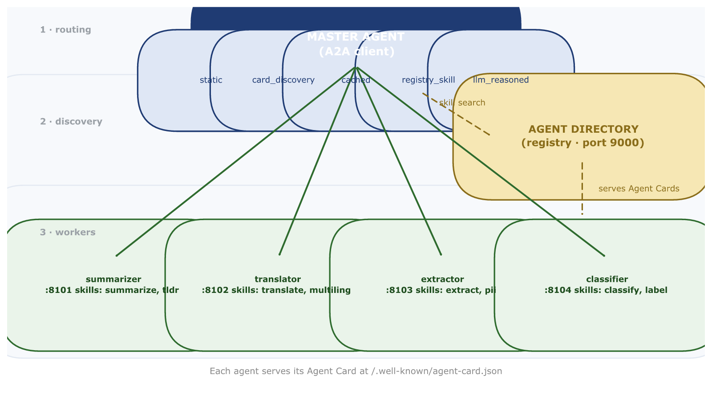
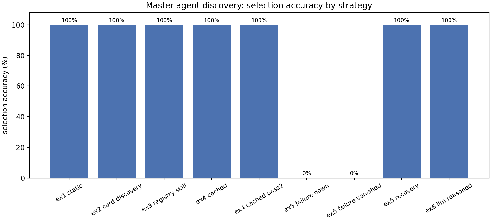
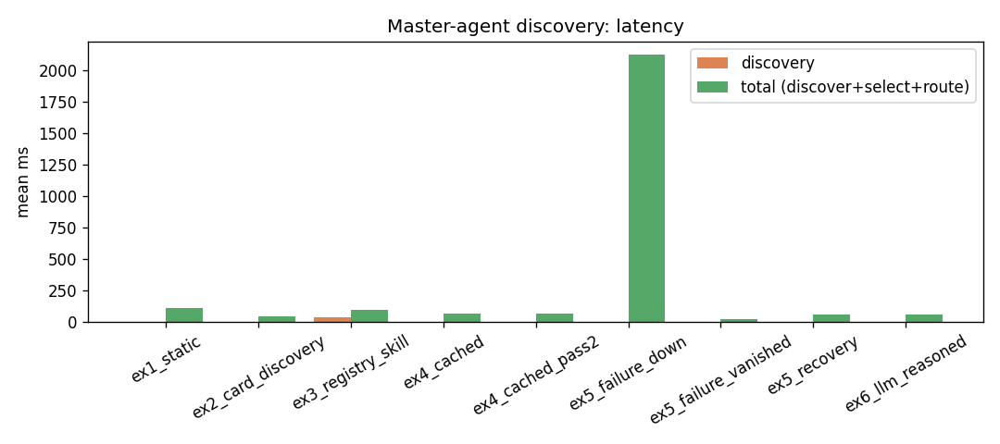
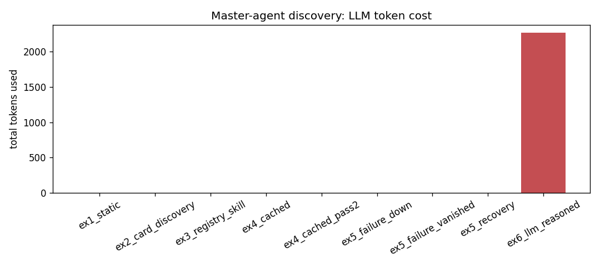
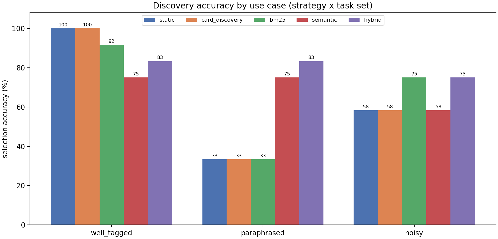

# How Does One AI Agent Know Which Other AI Agent To Call?

**A beginner-friendly, measurement-backed tour of 8 ways to route tasks to the right AI assistant — and which one you should pick for your situation.**

---

If you've ever watched a demo of "AI agents working together as a team," you've
probably seen the cool part: one agent fires a request, another one answers,
and pretty soon the whole task is done. But there's a quiet question that demo
never shows you, and it bugged me for weeks while I was building one of these
systems myself:

**When the boss-agent gets a request, how does it know which assistant to hand
it to?**

That single question — "who do I pass this to?" — is called **agent routing**
(or agent discovery). It sounds like a small detail. It is not. Get it wrong
and your "smart team of agents" becomes slow, confused, or worse: it quietly
hands your task to the *wrong* agent and tells you everything went fine.

So I stopped guessing and started measuring. I built a small, real, running
system with four AI assistants, tried **eight different ways** of deciding who
should handle each request, and wrote down the numbers. This article is the
story of what I learned — written in plain words, with no assumptions that
you've done any of this before.

---

## First, a quick picture of what an "agent team" looks like

Let's set the scene in everyday terms, because the jargon hides how simple the
idea actually is.

Think of an **agent** as a small AI-powered worker — an assistant with one
narrow job. In my lab I made four of them, each with a different specialty:

| assistant | its specialty |
|---|---|
| **The Summarizer** | reads a long text and gives you the short version |
| **The Translator** | translates between English, Spanish, French, and Hindi |
| **The Extractor** | pulls specific facts (names, dates, numbers) out of text |
| **The Classifier** | decides a label for text: "is this urgent?", "is this positive or negative?", "what topic is this?" |

On top of them sits a **Master** — the dispatcher. Its only job is to look at
an incoming request ("summarize this article for me") and decide: *which of the
four assistants should handle this?* That decision is the whole subject of
this article.

A small but very important detail: every assistant "advertises" itself using a
short **description card** (the technical world calls this an *Agent Card*). On
the card it writes its name, what it does, and the words that describe its
skills — like a menu a restaurant posts outside so passers-by know what's
inside. The Master's job is to read those menus and match requests to the right
restaurant.

To make the test fair (and honest), I also made the four assistants **deliberately
overlapping**. For example, both the Extractor and the Classifier deal with
"entities," and both the Summarizer and the Classifier analyze text. That way,
routing is a *real decision* — not a trivially easy one.



Then I wrote **12 benchmark requests** (things a user might actually type) and
measured one thing over and over: *did the Master send each request to the
assistant that was actually right for it?* That percentage — routing accuracy —
became my scoreboard. Every method I tried used the same Master, the same
requests, the same scoreboard. Only the decision-making logic changed. That's
the whole secret of a fair comparison: change exactly one thing.

---

## The eight ways to route a request

Here's the part I found genuinely interesting: there are many, *very different*
ways to answer "who should handle this?" — and each one is a trade-off. Some
are instant but rigid. Some are flexible but slow. Some cost money per request.
Some need extra software. There is no universal best — which is exactly why I
tested all eight.

For each one I'll tell you: **how it thinks** (with an everyday analogy), its
**strengths**, its **weaknesses**, and **when it's a good fit**.

### 1. The laminated map (static routing)

**How it thinks.** Imagine the Master has a printed map from last year with
every assistant's name and address. "Summarize" → Summarizer, "Translate" →
Translator. Done. No thinking, no asking around.

**The good.**
- Instant. We measured it at roughly **0.01 milliseconds** — for all practical
  purposes, zero.
- Dead simple. Nothing to install, nothing to fail, no moving parts.

**The bad.**
- **It goes out of date the moment anything changes.** Add a new assistant?
  Move one to a different machine? You have to rewrite the map and redeploy
  the whole system.
- It can't adapt to anything it hasn't seen. If a request doesn't use the exact
  words on the map, the Master is stuck.
- Other systems can't share your map, so this doesn't scale across teams.

**Good fit when:** you have a tiny, permanent, hand-controlled setup — a demo,
a prototype, a small fixed fleet.

---

### 2. Reading the menus once, in the morning (card discovery)

**How it thinks.** At startup, the Master walks to every assistant's address,
reads its description card, and files the skills away in memory. From then on,
routing is: compare the request's words to each assistant's skill words, and
pick the best match.

**The good.**
- **Data-driven.** The description comes from each assistant itself, so there's
  no manual list to keep in sync. Change an assistant's card, restart, done.
- Almost as fast as the laminated map after the one-time setup (~0.001 ms per
  request).
- No central software to build or maintain.

**The bad.**
- The Master still needs a starting list of addresses to visit.
- If an assistant is asleep *at that one moment in the morning*, it silently
  never makes it onto the menu list — and requests that should go to it get
  routed elsewhere with no warning. (More on this later — it's the scariest
  finding of the whole project.)
- It matches *words*. If a user says "give me the gist" but the card says
  "summarize," the words don't overlap and it may pick wrong.

**Good fit when:** a small-to-medium team that changes over time, where you want
speed and simplicity.

---

### 3. The shared phone book (registry / directory)

**How it thinks.** Everyone (the Master *and* the assistants) uses a central
phone book. Assistants register themselves in it; the Master looks up "who can
summarize?" in the book on every request. Think of it as the corporate
directory of your agent team.

**The good.**
- **One source of truth.** Assistants can appear, leave, or move — the phone
  book is updated once and everyone benefits.
- Scales to big fleets, and you can put security and logging in one place.
- The Master only needs to know one address: the phone book's.

**The bad.**
- **Every request pays a small delay to phone the book** — we measured ~21
  milliseconds on a local machine. That's thousands of times slower than the
  in-memory methods.
- The phone book is a single point of failure. If *it* goes down, nobody can
  find anybody.
- It needs plumbing: assistants must remember to register and unregister, and
  entries go stale if they don't.

**Good fit when:** a large team managed by many groups, where central
management and search matter more than per-request speed.

---

### 4. The sticky notes (caching)

**How it thinks.** Same phone book — but now the Master writes frequently-used
answers on sticky notes and keeps them on its desk. The first lookup goes to
the book; every repeat answer for a short while comes from the sticky note.

**The good.**
- **You get the phone book's benefits at near-instant speed** (~0.03 ms vs
  ~21 ms). In our test, 36 out of 36 lookups hit the sticky notes, and accuracy
  stayed at 100%.
- Takes load off the central phone book.

**The bad.**
- **The sticky notes can be stale.** If an assistant moved five seconds ago,
  the note still points to the old address until it expires (ours lasted 30
  seconds).
- More machinery to manage, and it still can't notice a vanished assistant.

**Good fit when:** production systems under real traffic, where every
millisecond counts.

---

### 5. The word-matching expert (BM25)

**How it thinks.** Before judging, the Master indexes every description card
into a small search engine. When a request arrives, it scores each card by how
well the request's words match — but not naively. Rare words count more than
common ones, and longer matches count for more. (Technically this algorithm is
called **BM25**, and it's a classic from search-engine research — it's the same
family of idea behind how old-school search boxes ranked results.)

**The good.**
- **The best "match the words exactly" accuracy** of anything we tested: 92%
  on normal requests, 75% even on tricky ones.
- Fast (~0.2 ms), uses no AI model at all, and you can read exactly *why* it
  chose what it chose.

**The bad.**
- **It only understands words it has already seen.** If someone rephrases a
  request using synonyms that never appear on any card, it gets lost (33% on
  our paraphrased test — basically guessing).

**Good fit when:** your requests use the same vocabulary as your descriptions
(very common in real products), or as one half of method 7.

---

### 6. The meaning-matcher (semantic search)

**How it thinks.** This one changes the game. Instead of comparing words, it
compares *meaning*. The Master converts every description card — and every
incoming request — into a list of numbers (an **embedding**, in the jargon)
that captures what the text is *about*. "Summarize," "give me the gist," and
"tl;dr this for me" all get very similar numbers, even though they share almost
no words. Then it simply asks: whose description numbers are closest to the
request's numbers?

**The good.**
- **It understands paraphrasing** — which is exactly how humans talk. On our
  paraphrased test it scored 75%, where every word-matching method scored 33%.
- No skill-word vocabulary to maintain. It generalizes to wording nobody
  planned for.

**The bad.**
- **Slowest of the cheap methods** (~30–66 ms per request — that's an AI model
  doing the "translating into numbers" step every single time).
- Counterintuitively, it's the *weakest* on requests where the right words are
  all present (75% vs 92% for BM25), because it ignores the exact-match
  signal.
- Adds a dependency on an embedding model.

**Good fit when:** users phrase things freely and your descriptions don't use
their words — messy, human, real-world requests.

---

### 7. The wise blend (hybrid: BM25 + semantic)

**How it thinks.** Why choose between the word-expert and the meaning-expert?
The hybrid asks **both** — ranks all assistants by matching words *and* by
matching meaning — then blends the two rankings into one. The blend uses a
simple, well-known trick: if an assistant is near the top in *either* ranking,
it gets points; the assistant with the most points across both wins. (The
technical name for this blend is **Reciprocal Rank Fusion**, but don't worry
about the name — the idea is just "listen to both experts and combine their
opinions.")

**The good.**
- **The only method that scored 75% or better in every single test we threw at
  it.** Normal requests, paraphrased requests, noisy requests — never below 75%.
- No training, no extra AI models beyond the embedder, no tokens to pay for.

**The bad.**
- The most expensive of the non-LLM methods (~40–76 ms per request).
- Two things to tune instead of one (the word-matching parameters and the blend
  strength).

**Good fit when:** you don't fully control how users will phrase things — which
means most real systems.

---

### 8. The smart intern (LLM-based routing)

**How it thinks.** The Master hands the whole pile of description cards to a
large language model (an **LLM** — a system like the one you're probably using
to read this) and asks: "Read these, read the request, and tell me who should
handle this." The LLM actually *understands* the request and makes a judgment
call.

**The good.**
- **The deepest understanding of all.** Paraphrase, ambiguity, even requests
  that touch two specialties at once — no scoring formula can match it.
- No skill-word vocabulary to maintain.

**The bad.**
- **It costs money and time.** A model like this reads everything in "tokens"
  (chunks of text), and our 12-request test burned ~2,266 tokens. Every request
  is slower, too.
- **It can be wrong in a weird way**: it occasionally invents an assistant that
  doesn't exist. A scoring method never does that.
- Honestly overkill for a small, cleanly-described team.

**Good fit when:** the requests are genuinely fuzzy and open-ended, and you're
willing to pay for judgment.

---

## What I actually did: the experiments

I ran my comparisons in two layers. The first layer (the **ladder**) answered
one question at a time — "how fast?", "how accurate?", "what happens when
things break?". The second layer was the one that changed my mind: I stopped
asking "which method is best?" and started asking "**which method is best for
which kind of request?**"

### Layer 1: the ladder

| experiment | what it tested | what we measured |
|---|---|---|
| 1. static | the laminated map | 100% accurate, ~0.01 ms |
| 2. card discovery | reading menus once | 100% accurate, ~0 ms |
| 3. registry | the shared phone book | 100% accurate, but **~21 ms** per lookup |
| 4. cached | sticky notes | 100% accurate, ~0.03 ms, 36/36 hits |
| 5a. assistant asleep | request sent to a dead assistant | 0% accurate, 2.1 s wait, 3 fallbacks |
| 5b. assistant vanished | dead assistant never on the menu | **0% accurate, and *zero* errors reported** |
| 5c. assistant recovers | restart an assistant | back to 100% |
| 6. LLM routing | the smart intern picks | 100% accurate, **2,266 tokens** |







Two results from this layer genuinely surprised me:

1. **Asking the central phone book costs ~21 milliseconds *even on one
   computer*.** That's thousands of times slower than remembering the answer in
   memory. The lesson: if you use a registry, *cache it* — that single change
   is the highest-value optimization in the whole system.

2. **The scariest failure is the silent one.** When an assistant was asleep but
   still listed, the Master tried it, noticed it failed, and tried someone else.
   Messy, but not fatal. But when the assistant was asleep at the moment the
   Master read the menus, it simply never appeared on the list — so the Master
   sent its requests to the wrong assistant *and reported no error at all*.
   No fallback, no log. **None of the eight methods catches this on its own.**
   Whatever you build, you need a separate "is everyone who should be here
   actually here?" check. This finding is worth more than any speed difference
   between methods.

### Layer 2: the test that changed my mind

Remember how every method scored 100% on the ladder? That's not because they're
all equally good — it's because **my test requests were too easy**. Every
request used the exact words from the descriptions. Real users don't do that.

So I built three different kinds of test, to force the methods to fight:

- **Neat requests** — the polite case: request words match the description
  words exactly. (My original 12.)
- **Paraphrased requests** — the human case: same intent, but reworded so it
  shares *no* words with any description ("could you boil this down to the
  main points?" instead of "summarize").
- **Noisy requests** — the sneaky case: a compound request that also contains
  words belonging to the *wrong* assistant on purpose ("translate this and
  also summarize the intro") — a distractor that looks relevant.

Every method ran against all three. Here's the scoreboard:



| | neat requests | paraphrased | noisy |
|---|---|---|---|
| **static** (laminated map) | **100%** | 33% | 58% |
| **card discovery** (read menus) | **100%** | 33% | 58% |
| **BM25** (word-expert) | 92% | 33% | **75%** |
| **semantic** (meaning-matcher) | 75% | **75%** | 58% |
| **hybrid** (both experts) | 83% | **83%** | **75%** |

(33% is a four-way coin flip, by the way — with four assistants, pure guessing
is 25%, so 33% means "might as well not try.")

Three lessons jumped out:

1. **When requests use the right words, word-matching wins — and it's cheap.**
   On neat requests, BM25 and card discovery were both accurate and nearly
   free. The meaning-matcher was both the *weakest* here (75%) *and* the
   slowest. Don't pay for AI-powered understanding when your users type in
   your vocabulary.

2. **When humans paraphrase, meaning matters.** All three word-matching methods
   collapsed to a coin flip (33%) on paraphrased requests, while semantic hit
   75% and hybrid 83%. This is exactly the situation where the slower,
   fancier method earns its keep.

3. **When requests are noisy, neither expert alone is enough.** The
   meaning-matcher dropped back to 58% because a distractor keyword pulled the
   request's meaning toward the wrong assistant. Word-matching held at 75%.
   And the hybrid — listening to both experts — never dropped below 75% in
   *any* test. **That consistency is the headline result.** If you only
   remember one number from this article: in every situation we tested, the
   hybrid was 75% or better. No other method can say that.

This matches what the research literature reports, by the way: combining
word-matching and meaning-matching beats either one alone, and — in the
related world of routing to LLM assistants — **no single method wins every
time**. The right answer always depends on your situation. That's what we set
out to prove, and the measurements say it loud and clear.

---

## The cheat sheet: which situation → which method

Okay, the practical part. Here's the short answer to the original question,
turned into a decision table you can copy:

| your situation | use this | because |
|---|---|---|
| Tiny, permanent setup (demo/prototype) | **static** (or card discovery) | nothing to build, instant |
| Small team that changes over time | **card discovery** | reads fresh descriptions once, ~free afterwards |
| Users use your exact words | **BM25 or card discovery** | most accurate *and* cheapest when words match |
| Users paraphrase, tags are messy | **semantic** | understands meaning, not just vocabulary |
| You can't predict how users will phrase things | **hybrid (BM25 + semantic)** | the only method ≥75% in every test |
| Big team, many groups, need central control | **registry** | one source of truth, searchable, governable |
| Big team *and* you care about speed | **registry + cache** | phone book's benefits at sticky-note speed |
| Genuinely fuzzy requests | **LLM routing** | real understanding — just pay for it |
| Any production system | **any method + health checks + fallbacks** | no method can spot a vanished assistant |

**And if you only have twenty seconds:**

- Small team, clean vocabulary → **card discovery** (add sticky notes if it's
  hot).
- Real users saying unpredictable things → **hybrid (BM25 + semantic)**. It
  never lets you down below 75%.
- Big governed team → **registry + cache**.
- Truly fuzzy, judgment-heavy requests → **LLM**, and only then.

---

## The part nobody puts in the demo

Two things I want to leave you with that aren't in the marketing videos:

**1. A "silent misroute" is the scariest bug in agent routing.** A slow routing
method is an annoyance. A routing method that sends your task to the wrong
assistant *without an error* is a correctness bug — the system looks fine and
produces confident nonsense. Every architecture you read about should include
an answer to: "how do we know our agent roster is complete, and what happens if
an agent disappears?"

**2. "Best method" doesn't exist — "best method *for this*" does.** The whole
point of my matrix experiment is that the answer to "which should I use?" is
always "**it depends, and here's what it depends on.**" Word-matching is great
when words match; meaning-matching is great when they don't; blending is great
when you don't know. Choose based on your users' behavior, not on vibes.

And this "silent but confident" failure isn't unique to agents. The same shape
shows up everywhere data flows — a system that keeps producing answers that
look right while quietly being wrong. Here's a table of the classic ones from
the data world, what causes them, and the gates that catch them:

| The trick | Root cause | Blast radius | Stopped |
|---|---|---|---|
| Semantic-Layer Injection | Metadata treated as instruction | Data exfiltration, unauthorized actions | Gate 1 |
| Null-as-zero | Silent upstream failure | Inverted trend, wrong decision | Gate 2 |
| Schema drift | Enum/format changed underneath | Silent under-count | Gate 2 |
| Stale partition | Data hasn't landed yet | Incomplete period reported as final | Gate 2 |
| Outlier / test row | Unfiltered non-prod data | Aggregates thrown into fiction | Gate 2 |

The pattern to steal: every failure mode gets a **named gate** that stops it —
"null stays null (never zero)", "reject unknown enum values", "don't publish a
period until its data has landed". Route your agent, but give it the same
discipline: decide up front which silent failures are unacceptable, and put a
gate in front of each one.

---

## Try it yourself (it's free and runs offline)

The whole lab is open source. It runs on a normal laptop with no cloud, no API
keys, and no internet needed:

```
git clone https://github.com/Pratyush-Mohanty/adk-a2a-discovery-lab
pip install -r requirements.txt
py -m discovery_lab.run        # runs all experiments + makes the charts
```

In a few seconds you'll have regenerated every number in this article, plus
the charts. If you're building a multi-agent system, I'd strongly recommend
spending an afternoon on your routing layer. It's the cheapest place to buy
speed, reliability, and peace of mind — and, as the vanished-assistant
experiment shows, the most dangerous place to skip.

---

*Built with Google ADK and the A2A protocol (a2a-sdk 1.1.2). Full methodology,
all measurements, and the experiment-by-experiment details are in the repo's
docs — the technical report, the decision guide, and the run notebook.*
